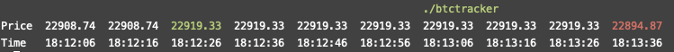

# btctracker
Simple realtime BTC-USD tracker with color coding for price changes.

## Overview
A super simple cli based utility that can track the price of BTC-USD (via the [coinbase](https://api.coinbase.com/v2/prices/BTC-USD/spot) api) and annotate the price changes in color red - denoting a price decrease or green - denoting a price increase in real-time.

The params `bucket` and `interval` control the number of datapoints to display on stdout at any given time, and the refresh-interval for fetching the latest price respectively.

